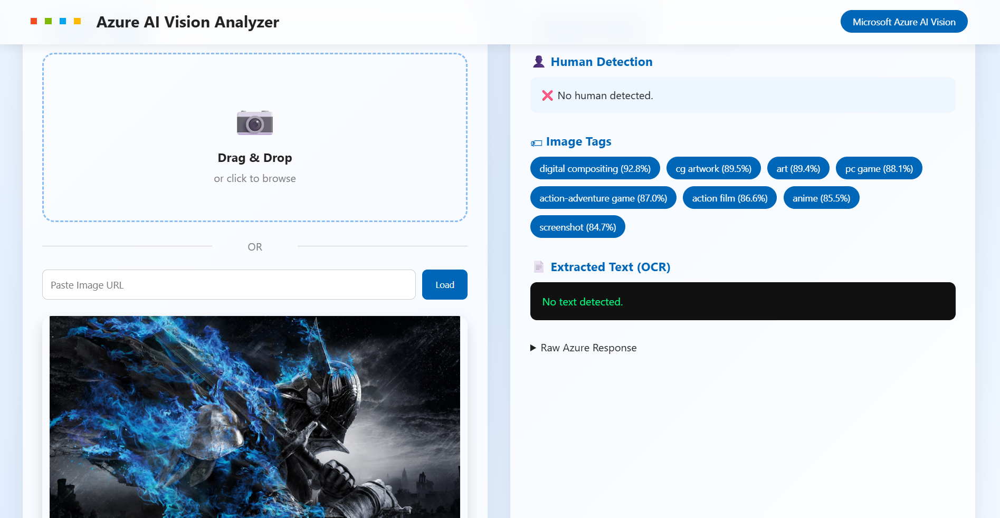
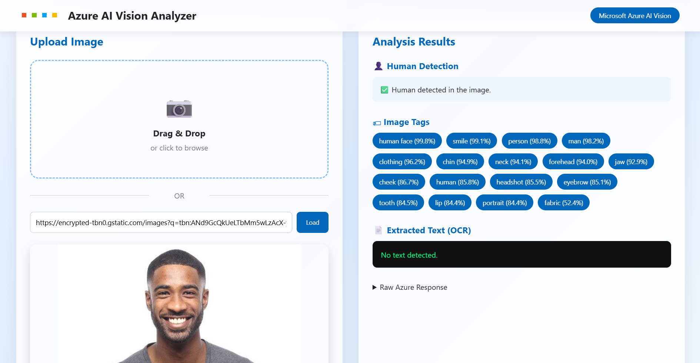

# Azure AI Vision Analyzer

## Overview

A web application built using Flask and Microsoft Azure AI Vision that analyzes uploaded images.

## Features

- Image Upload
- Drag and Drop Upload
- Image URL Analysis
- Image Preview
- Image Tag Detection
- OCR (Text Extraction)
- Human Detection using Azure AI Vision Tags

## Technologies Used

- Python
- Flask
- HTML
- CSS
- JavaScript
- Microsoft Azure AI Vision

## Installation

```bash
pip install -r requirements.txt
```

Create a `.env` file inside the backend folder.

```env
VISION_ENDPOINT=YOUR_ENDPOINT
VISION_KEY=YOUR_KEY
```

Run:

```bash
python app.py
```

Open:

```
http://127.0.0.1:5000
```
## Screen Shots
### Image Upload



### Human Face Detection



## Author

Pranav